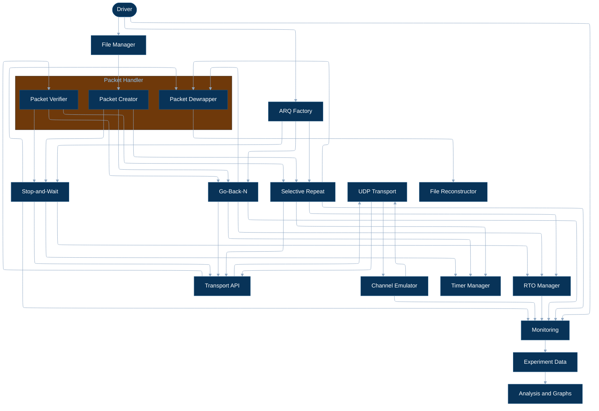
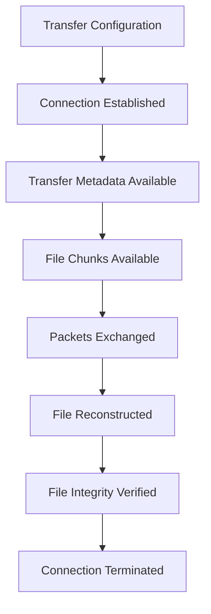
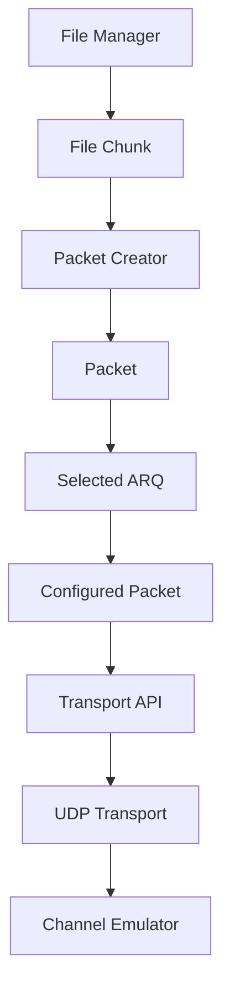
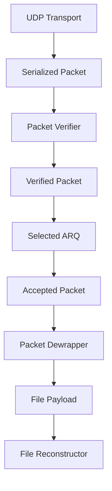
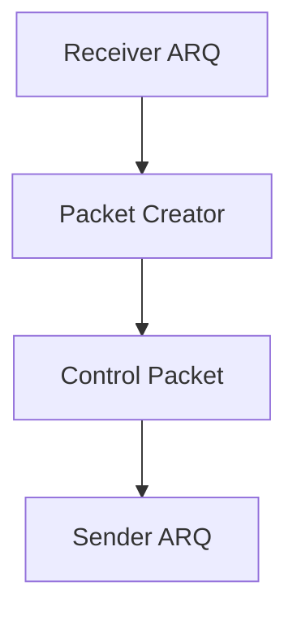
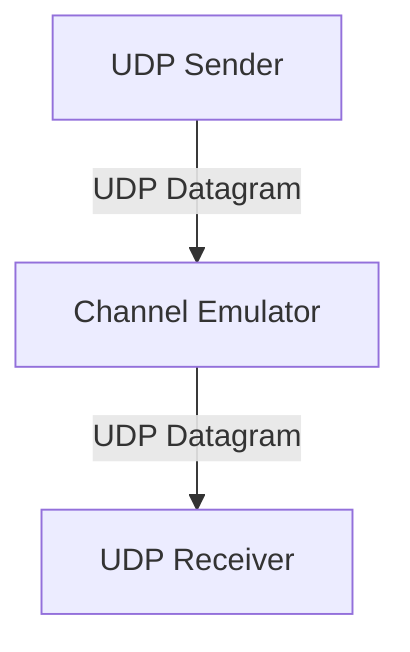
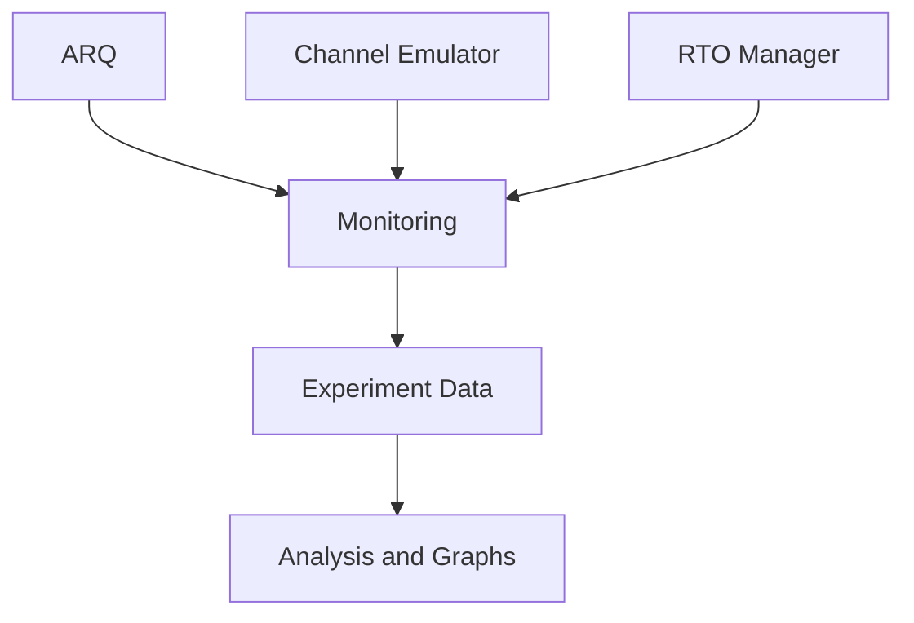
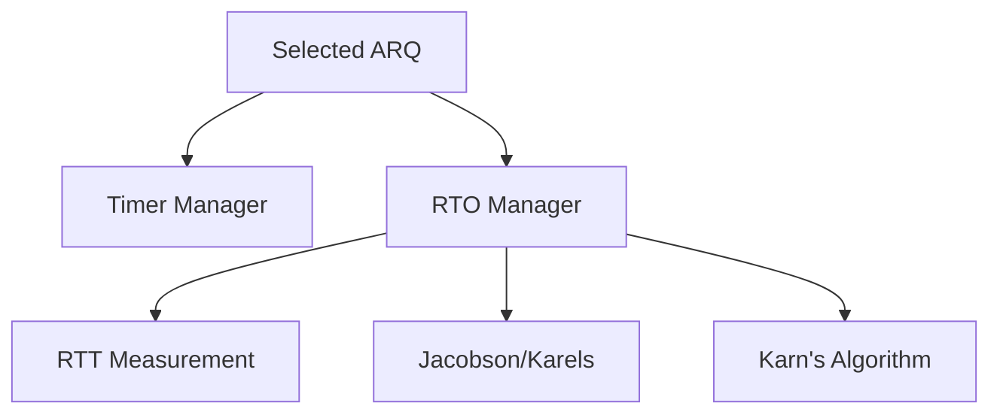

# System Architecture

## 1. Overview

The system implements reliable file transfer over UDP using interchangeable ARQ protocols. The architecture separates file handling, packet handling, ARQ reliability, transport, channel emulation, timeout estimation, and experiment analysis.

## 2. Architecture

The main architecture shows component relationships. The detailed transfer path is defined by the data-flow diagrams below.

## 3. Transfer Lifecycle

The complete transfer progresses through connection establishment, data transfer, acknowledgement exchange, reconstruction, integrity verification, and termination.

Control packets such as SYN, ACK, NACK, and FIN are exchanged through the same packet and transport path as data packets.

## 4. Data Flow

### 4.1 Sender

### 4.2 Receiver

The Transport API provides received serialized packet data to the Packet Verifier. The verifier checks the packet checksum. A corrupted packet is not passed to ARQ as trusted packet data.

A verified packet is passed to the selected ARQ implementation. ARQ determines whether the packet is accepted, buffered, or discarded according to the protocol. Only an accepted packet is passed to the Packet Dewrapper, which extracts the file payload for the File Reconstructor.

### 4.3 Control Packet Feedback

The receiver ARQ generates ACK, NACK, and connection-control packets through the Packet Creator. The resulting control packet follows the same Transport API, UDP Transport, Channel Emulator, Packet Verifier, and ARQ path in the reverse direction.

The ARQ layer determines when a control packet is required and what protocol information it carries. The Packet Handler defines its packet representation.

## 5. Module Responsibilities

### 5.1 File Manager

Responsible for file-level operations:

- File input
- File chunking
- File hashing

The File Manager produces chunks for transmission and provides file information required for final integrity verification.

### 5.2 Packet Handler

The Packet Handler provides the packet operations required at different stages of transfer.

#### Packet Creator

- Initializes a packet from a file chunk or control information
- Provides the packet representation used by ARQ
- Provides serialization of the configured packet for transmission

#### Packet Verifier

- Checks the packet checksum
- Rejects corrupted packets

The verifier does not interpret an untrusted sequence or acknowledgement value from a corrupted packet.

#### Packet Dewrapper

- Extracts the payload from an accepted packet
- Passes recovered file data to the File Reconstructor

The Packet Handler does not implement ARQ behavior, retransmission, or window management.

### 5.3 ARQ Protocols

The selected ARQ implementation controls reliable transfer between the two endpoints:

- Stop-and-Wait
- Go-Back-N
- Selective Repeat

ARQ is responsible for:

- Configuring protocol-specific packet fields
- Sequence and acknowledgement handling
- Window management
- ACK and NACK handling
- Retransmission
- Duplicate and out-of-order handling
- Protocol state
- Determining whether a received packet is accepted, buffered, or discarded

The ARQ layer interacts with the Transport API rather than directly with UDP sockets.

### 5.4 Transport API

The Transport API provides the interface between ARQ and UDP communication.

Responsibilities include:

- Sending serialized packets
- Receiving serialized packets
- Address management

### 5.5 UDP Transport

UDP Transport is responsible only for UDP communication:

- UDP socket creation
- Binding
- Sending bytes
- Receiving bytes

It does not implement reliability, sequencing, retransmission, or timeout estimation.

### 5.6 Channel Emulator

The Channel Emulator acts as an intermediary between the two UDP endpoints.

It can introduce controlled network conditions:

- Packet loss
- Packet duplication
- Packet corruption
- Packet reordering
- Network delay
- Delay jitter

The same channel conditions apply to reverse-direction control packets.

### 5.7 Timer Manager

Provides timer functionality required by the ARQ protocols:

- Timer creation
- Timer start
- Timer restart
- Timer cancellation
- Timer expiration detection

Timer behavior may differ between Stop-and-Wait, Go-Back-N, and Selective Repeat.

### 5.8 RTO Manager

Provides adaptive retransmission timeout estimation:

- RTT measurement
- Jacobson/Karels estimation
- RTO calculation
- Karn's algorithm
- RTO state management

The ARQ protocols use the RTO Manager to obtain retransmission timeout values.

### 5.9 File Reconstructor

Responsible for receiver-side file reconstruction:

- Accepting file payloads from the Packet Dewrapper
- Ordering and writing received file data according to transfer state
- Final file integrity verification

### 5.10 Monitoring and Analysis

Runtime components produce monitoring data for experiments.

Relevant measurements include:

- Packets sent and received
- Retransmissions
- Timeouts
- RTT samples
- RTO values
- Transfer duration
- Bytes transferred
- Goodput

## 6. Timing Architecture

The Timer Manager handles timer operation. The RTO Manager determines retransmission timeout values from RTT measurements and applies the selected estimation rules.

## 7. Architectural Principles

1. File handling is separate from packet and ARQ logic.
2. Packet creation, verification, and payload extraction are separate from ARQ behavior.
3. ARQ controls reliable transfer and protocol-specific packet fields.
4. The Packet Handler represents and serializes packets and validates received packet checksums.
5. Corrupted packet contents are not treated as trusted input to ARQ.
6. Transport provides UDP communication only.
7. The Channel Emulator is an independent network intermediary.
8. Timers and RTO estimation are separate services used by ARQ.
9. File reconstruction and final integrity verification occur at the receiver.
10. Monitoring and analysis do not determine protocol behavior.
