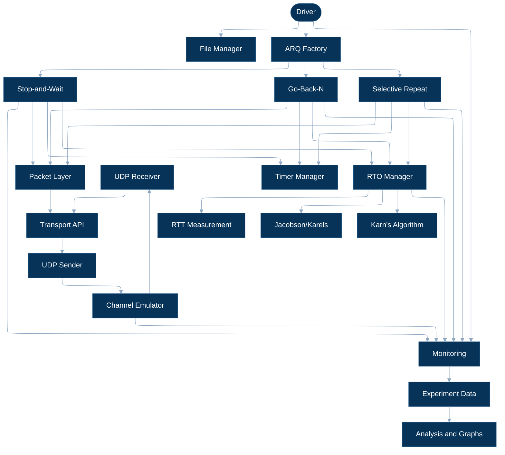
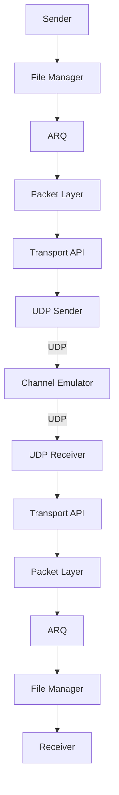
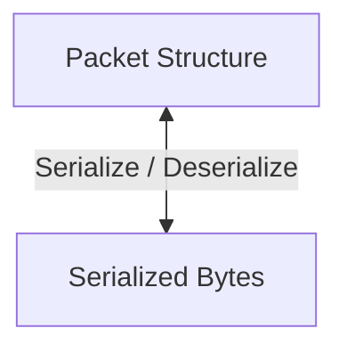
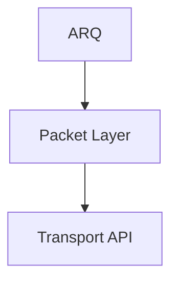
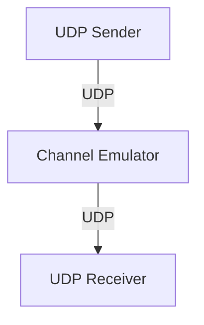
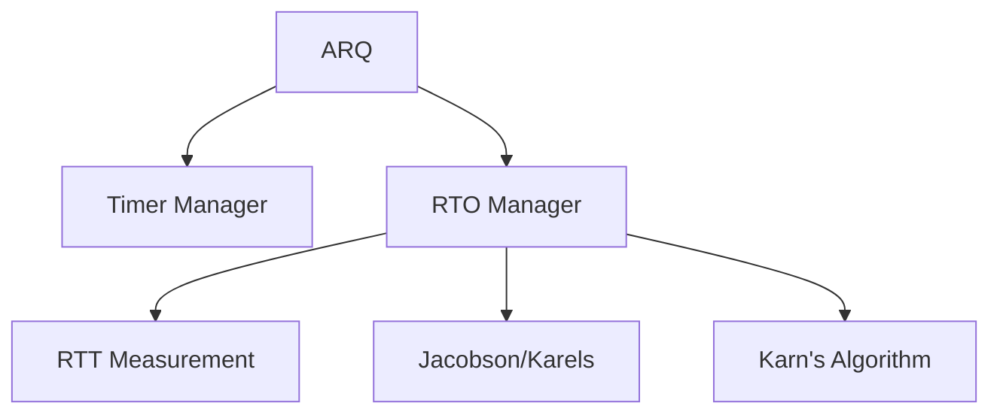
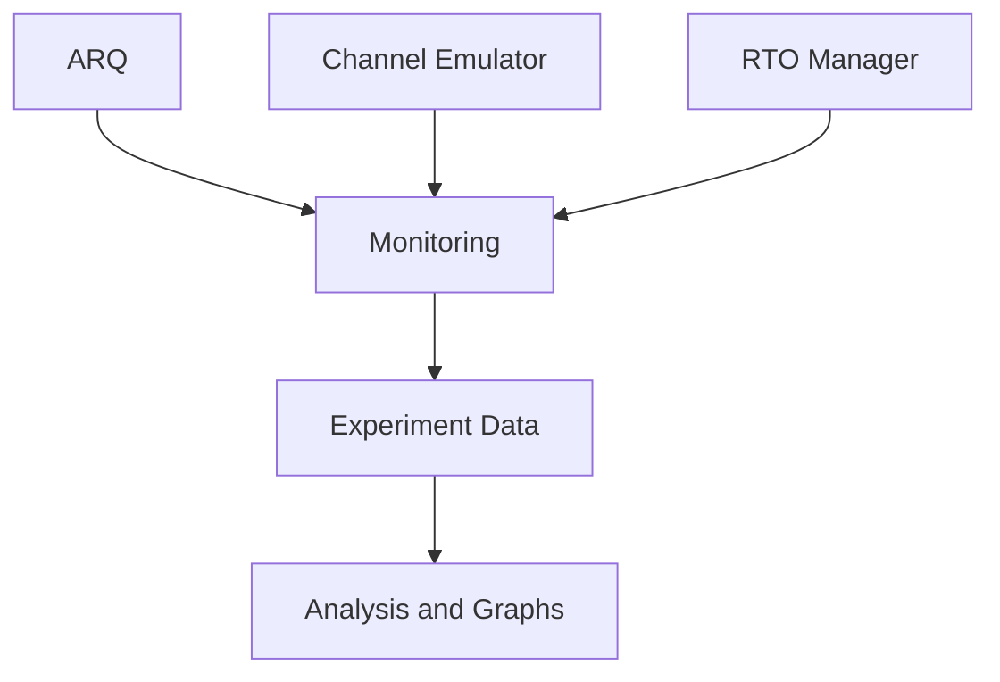

# System Architecture

## 1. Overview

The system implements reliable file transfer over UDP using interchangeable ARQ protocols. Reliability is provided above UDP through Stop-and-Wait, Go-Back-N, and Selective Repeat protocols.

The architecture separates:

- File management
- ARQ reliability mechanisms
- Packet representation
- Transport interfaces
- UDP communication
- Network channel emulation
- Timeout and RTT estimation
- Monitoring and experimental analysis

## 2. Architecture

## 3. Data Flow

The transfer path between the sender and receiver is:

The reverse direction follows the same path. ACK packets therefore pass through the Channel Emulator in the same manner as data packets.

## 4. Module Responsibilities

### 4.1 File Manager

Responsible for file-level operations:

- File input and output
- Data chunking
- File hashing
- File reconstruction
- Final integrity verification

The File Manager does not handle UDP communication or ARQ logic.

### 4.2 ARQ Protocols

The ARQ layer provides reliable transfer mechanisms:

- Sequence numbering
- ACK processing
- Retransmission
- Window management
- Duplicate handling
- Out-of-order handling
- Protocol-specific reliability logic

The three implementations share a common ARQ interface:

- Stop-and-Wait
- Go-Back-N
- Selective Repeat

The ARQ layer does not directly access UDP sockets.

### 4.3 Packet Layer

Responsible for packet representation and conversion:

Responsibilities include:

- Packet field definition
- Packet construction
- Serialization
- Deserialization
- Checksum generation
- Checksum verification
- Malformed packet validation
- ACK packet representation

The Packet Layer does not implement ARQ or sliding-window logic.

### 4.4 Transport API

The Transport API provides the interface between ARQ and the underlying network communication.

The ARQ implementation interacts with the Transport API rather than directly with UDP socket operations.

### 4.5 UDP Transport

UDP Transport is responsible only for UDP communication:

- UDP socket creation
- Binding
- Sending serialized packet data
- Receiving serialized packet data
- Address management

It does not implement reliability, retransmission, packet sequencing, or timeout estimation.

### 4.6 Channel Emulator

The Channel Emulator acts as an intermediary between the sender and receiver.

It can introduce controlled network conditions:

- Packet loss
- Packet duplication
- Packet corruption
- Packet reordering
- Network delay
- Delay jitter

The emulator operates on packets transmitted through UDP and is independent of ARQ protocol logic.

### 4.7 Timer Manager

Provides timer functionality required by ARQ protocols:

- Timer creation
- Timer start
- Timer restart
- Timer cancellation
- Timer expiration detection

Timer behavior may differ between Stop-and-Wait, Go-Back-N, and Selective Repeat.

### 4.8 RTO Manager

Provides adaptive retransmission timeout estimation.

Responsibilities include:

- RTT measurement
- Jacobson/Karels estimation
- RTO calculation
- Karn's algorithm
- RTO state management

The ARQ protocols use the RTO Manager to obtain current timeout values.

## 5. Timing Architecture

The Timer Manager handles timer operation, while the RTO Manager determines the appropriate retransmission timeout.

## 6. Observability

Runtime components produce monitoring data for experimental analysis.

Relevant measurements include:

- Packets sent and received
- Retransmissions
- Timeouts
- RTT samples
- RTO values
- Transfer duration
- Bytes transferred
- Goodput

## 7. Architectural Principles

1. ARQ is transport-independent.
2. Packet representation is independent of ARQ logic.
3. UDP provides datagram transport only.
4. The Channel Emulator is an independent network intermediary.
5. Timers and RTO estimation are separate services.
6. Experiment analysis operates on collected runtime data.