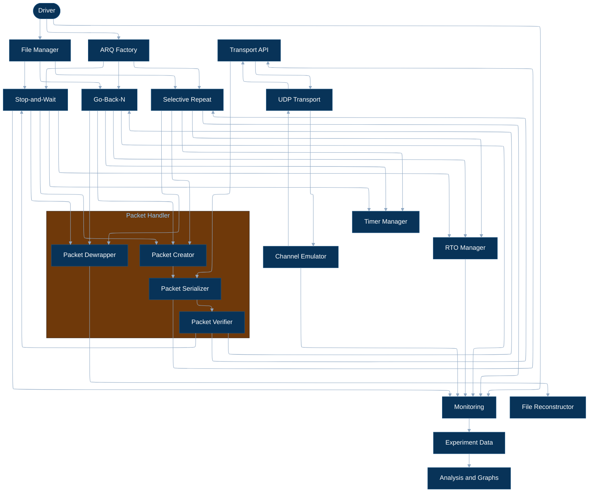
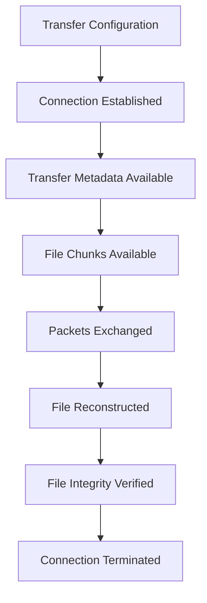
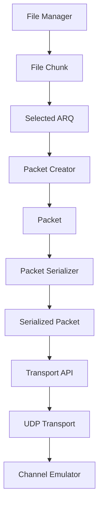
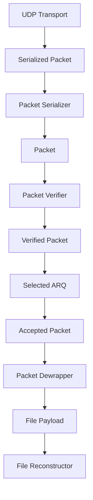
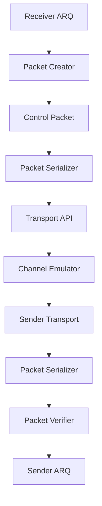
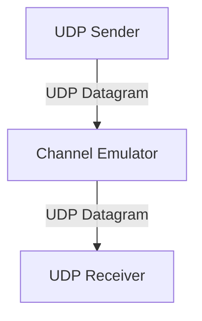
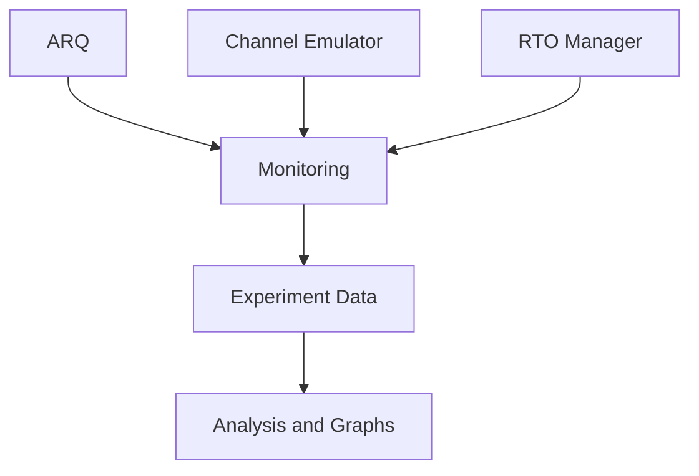
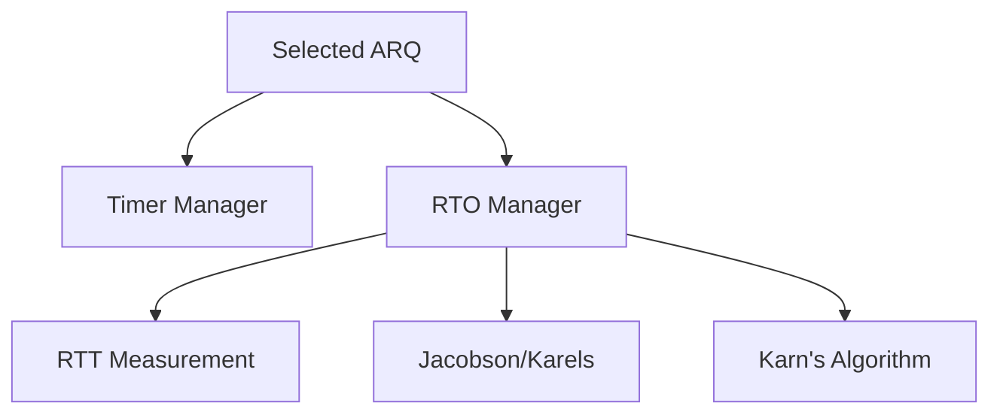

# System Architecture

## 1. Overview

The system implements reliable file transfer over UDP using interchangeable ARQ protocols. The architecture separates file handling, packet handling, ARQ reliability, transport, channel emulation, timeout estimation, file reconstruction, and experiment analysis.

## 2. Architecture

The main architecture shows component relationships. The detailed transfer path is defined by the data-flow diagrams below.

## 3. Transfer Lifecycle

The complete transfer progresses through connection establishment, data transfer, acknowledgement exchange, reconstruction, integrity verification, and termination.

Control packets such as SYN, ACK, NACK, and FIN are exchanged through the same Packet Handler and transport path as data packets.

## 4. Data Flow

### 4.1 Sender

The File Manager provides raw file chunks to the selected ARQ protocol. ARQ determines whether and when a chunk is sent, assigns the required protocol information such as the sequence number and packet type, and requests construction of the corresponding packet.

The Packet Creator constructs the logical packet from the information provided by ARQ. The Packet Serializer converts the packet into the wire-format byte sequence for transmission.

ARQ does not require the File Manager to construct or partially construct protocol packets.

### 4.2 Receiver

The Transport API provides received serialized packet data to the Packet Handler. The Packet Serializer deserializes the byte sequence into a packet representation.

The Packet Verifier checks the packet structure and checksum. A corrupted packet is treated as invalid and its untrusted fields are not used by ARQ.

A verified packet is passed to the selected ARQ implementation. ARQ determines whether the packet is accepted, buffered, or discarded according to the protocol. Only an accepted packet is passed to the Packet Dewrapper.

The Packet Dewrapper extracts the file payload and provides the resulting file data to the File Reconstructor.

ARQ is responsible for packet ordering and duplicate handling. The File Reconstructor does not implement ARQ behavior.

### 4.3 Control Packet Feedback

The receiver ARQ generates ACK, NACK, and connection-control packets through the Packet Creator. The Packet Handler serializes the resulting packet, and the control packet follows the same transport and channel path as data packets.

The receiving endpoint deserializes and verifies the control packet before passing it to its ARQ implementation.

The ARQ layer determines when a control packet is required and what protocol information it carries. The Packet Handler defines its packet representation and wire format.

## 5. Module Responsibilities

### 5.1 File Manager

Responsible for file-level operations:

- File input
- File chunking
- File hashing

The File Manager produces raw `FileChunk`s for transmission and provides file information required for final integrity verification.

The File Manager does not assign packet sequence numbers or construct protocol packets.

### 5.2 Packet Handler

The Packet Handler provides packet operations required at different stages of transfer.

#### Packet Creator

- Constructs packets from protocol information and payload data provided by ARQ
- Initializes packet fields
- Constructs both data and control packets

#### Packet Serializer

- Serializes packets into the defined wire format
- Deserializes received byte sequences into packets
- Handles network byte order
- Calculates and inserts the packet checksum
- Performs basic wire-format and buffer-length validation

#### Packet Verifier

- Validates received packet structure
- Verifies the packet checksum
- Rejects corrupted or invalid packets

The verifier does not interpret an untrusted sequence or acknowledgement value from a corrupted packet.

#### Packet Dewrapper

- Extracts the payload from an accepted DATA packet
- Converts the payload into file data for the File Reconstructor

The Packet Handler does not implement ARQ behavior, retransmission, ordering, or window management.

### 5.3 ARQ Protocols

The selected ARQ implementation controls reliable transfer between the two endpoints:

- Stop-and-Wait
- Go-Back-N
- Selective Repeat

ARQ is responsible for:

- Protocol state
- Sequence and acknowledgement handling
- Window management
- ACK and NACK handling
- Retransmission
- Duplicate and out-of-order handling
- Determining whether a received packet is accepted, buffered, or discarded
- Determining when protocol packets should be created
- Assigning protocol-specific packet information

ARQ interacts with the Transport API rather than directly with UDP sockets.

### 5.4 Transport API

The Transport API provides the interface between ARQ and UDP communication.

Responsibilities include:

- Sending serialized packets
- Receiving serialized packets
- Address management

The Transport API does not interpret packet contents or implement reliability.

### 5.5 UDP Transport

UDP Transport is responsible only for UDP communication:

- UDP socket creation
- Binding
- Sending bytes
- Receiving bytes

It does not implement reliability, sequencing, retransmission, checksum verification, or timeout estimation.

### 5.6 Channel Emulator

The Channel Emulator acts as an intermediary between the two UDP endpoints.

It can introduce controlled network conditions:

- Packet loss
- Packet duplication
- Packet corruption
- Packet reordering
- Network delay
- Delay jitter

The same channel conditions apply to reverse-direction control packets.

The Channel Emulator does not implement ARQ or retransmission logic.

### 5.7 Timer Manager

Provides timer functionality required by the ARQ protocols:

- Timer creation
- Timer start
- Timer restart
- Timer cancellation
- Timer expiration detection

Timer behavior may differ between Stop-and-Wait, Go-Back-N, and Selective Repeat.

The Timer Manager provides timing mechanisms but does not determine retransmission policy.

### 5.8 RTO Manager

Provides adaptive retransmission timeout estimation:

- RTT measurement
- Jacobson/Karels estimation
- RTO calculation
- Karn's algorithm
- RTO state management

The ARQ protocols use the RTO Manager to obtain retransmission timeout values.

The RTO Manager does not determine when retransmission occurs.

### 5.9 File Reconstructor

Responsible for receiver-side file reconstruction:

- Accepting file payloads from the Packet Dewrapper
- Writing and reassembling received file data
- Final file integrity verification

The File Reconstructor receives data after ARQ has handled packet ordering, duplication, buffering, and acceptance.

### 5.10 Monitoring and Analysis

Runtime components produce monitoring data for experiments.

Relevant measurements include:

- Packets sent and received
- Retransmissions
- Timeouts
- RTT samples
- RTO values
- Transfer duration
- Bytes transferred
- Goodput

Monitoring and analysis do not determine protocol behavior.

## 6. Timing Architecture

The Timer Manager handles timer operation. The RTO Manager determines retransmission timeout values from RTT measurements and applies the selected estimation rules.

ARQ uses the resulting timing information to make retransmission decisions.

## 7. Architectural Principles

1. File handling is separate from packet and ARQ logic.
2. File chunks contain raw file data and do not contain protocol sequence numbers.
3. ARQ receives file chunks, controls reliable transfer, and determines when protocol packets are created.
4. Packet creation, serialization, verification, and payload extraction are separate from ARQ behavior.
5. The Packet Handler represents, validates, and serializes packets but does not determine protocol behavior.
6. Corrupted packet contents are not treated as trusted input to ARQ.
7. Transport provides UDP communication only.
8. The Channel Emulator is an independent network intermediary.
9. Timers and RTO estimation are separate services used by ARQ.
10. File reconstruction and final integrity verification occur at the receiver after ARQ has handled packet ordering and acceptance.
11. Monitoring and analysis do not determine protocol behavior.