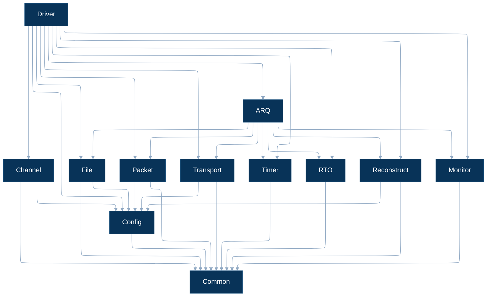
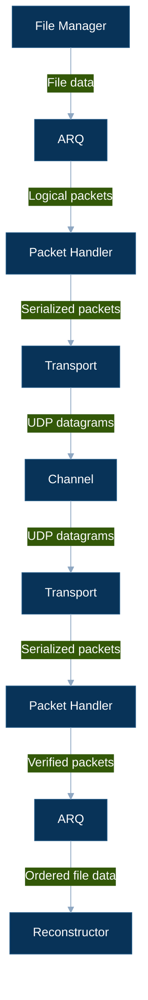

# Module Organization

## 1. Module Structure

```text
src/
├── common/
│   ├── types.h
│   └── constants.h
│
├── config/
│   ├── config.h
│   └── config.c
│
├── file/
│   ├── file_manager.h
│   └── file_manager.c
│
├── packet/
│   ├── packet.h
│   ├── packet_creator.c
│   ├── packet_verifier.c
│   ├── packet_serializer.c
│   └── packet_dewrapper.c
│
├── arq/
│   ├── arq.h
│   ├── arq.c
│   ├── stop_wait.c
│   ├── go_back_n.c
│   └── selective_repeat.c
│
├── transport/
│   ├── transport.h
│   └── transport.c
│
├── channel/
│   ├── channel.h
│   └── channel.c
│
├── timer/
│   ├── timer.h
│   └── timer.c
│
├── rto/
│   ├── rto.h
│   └── rto.c
│
├── reconstruct/
│   ├── reconstruct.h
│   └── reconstruct.c
│
├── monitor/
│   ├── monitor.h
│   └── monitor.c
│
└── driver/
    ├── driver.h
    └── driver.c
```

## 2. Module Dependencies



### Dependency Rules

| Module | May depend on | Does not depend on |
|---|---|---|
| `common` | Standard library | Any project module |
| `config` | `common` | Protocol implementations |
| `file` | `common`, `config` | `arq`, `transport`, `packet` |
| `packet` | `common`, `config` | `arq`, `transport`, `file` |
| `arq` | `common`, `packet`, `file`, `transport`, `timer`, `rto`, `reconstruct`, `monitor` | `driver`, `channel` |
| `transport` | `common`, `config` | `arq`, `packet` |
| `channel` | `common`, `config` | `arq`, `packet` |
| `timer` | `common` | `arq`, `rto` |
| `rto` | `common` | `arq`, `transport` |
| `reconstruct` | `common`, `config` | `arq`, `packet`, `transport` |
| `monitor` | `common` | Protocol control |
| `driver` | All required modules | - |

## 3. Interface Boundaries



## 4. Module Roles

| Module | Responsibility |
|---|---|
| `common` | Shared definitions |
| `config` | Transfer and experiment configuration |
| `file` | Source file access and chunking |
| `packet` | Packet construction, verification, serialization, and payload extraction |
| `arq` | Stop-and-Wait, GBN, SR protocol state and reliability |
| `transport` | UDP communication |
| `channel` | Network impairment emulation |
| `timer` | Timer management |
| `rto` | RTT estimation and retransmission timeout calculation |
| `reconstruct` | Destination file reconstruction and integrity verification |
| `monitor` | Runtime measurements and logging |
| `driver` | Initialization, coordination, and program execution |