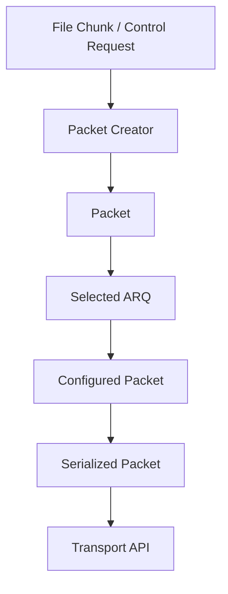
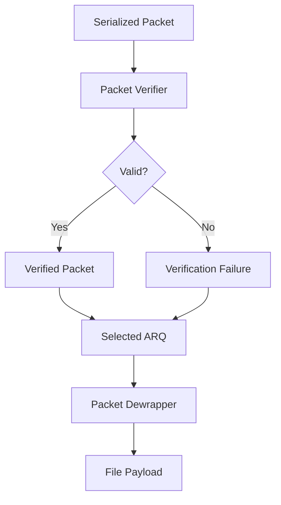

# Packet Format

## 1. Wire Format

```text
┌──────────────────────────────┐
│ Flags          1 byte        │
├──────────────────────────────┤
│ Number         2 bytes       │
├──────────────────────────────┤
│ Payload Length 2 bytes       │
├──────────────────────────────┤
│ Checksum       2 bytes       │
├──────────────────────────────┤
│ Payload        0-1024 bytes  │
└──────────────────────────────┘

Header: 7 bytes
Maximum payload: 1024 bytes
```

All multi-byte fields use network byte order (big-endian).

## 2. Fields

| Field | Size | Description |
|---|---:|---|
| Flags | 1 byte | Packet type and control flags |
| Number | 2 bytes | Sequence, acknowledgement, or negotiated parameter value |
| Payload Length | 2 bytes | Payload size in bytes |
| Checksum | 2 bytes | CRC-16 checksum |
| Payload | 0-1024 bytes | Optional data |

## 3. Flags

| Bits | Name | Purpose |
|---|---|---|
| 0 | DATA | Data packet |
| 1 | ACK | Acknowledgement |
| 2 | NACK | Negative acknowledgement |
| 3 | SYN | Connection establishment |
| 4 | FIN | Connection termination |
| 5 | WINDOW | Number field contains window size |
| 6-7 | PROTOCOL | ARQ protocol identifier |

Protocol identifier:

```text
00 = Stop-and-Wait
01 = Go-Back-N
10 = Selective Repeat
11 = Reserved
```

Flags may be combined where permitted.

## 4. Packet Construction



The Packet Creator initializes the packet. ARQ supplies protocol-specific fields. The Packet Handler calculates the checksum and serializes the packet.

## 5. Packet Reception



The Packet Verifier checks packet structure and checksum. A corrupted packet's fields are not trusted; ARQ receives only a verification failure.

ARQ decides how to handle invalid, duplicate, out-of-order, ACK, NACK, and control packets.

The Packet Dewrapper extracts payload only after ARQ accepts a packet for delivery.

## 6. Number Field

The Number field is a 16-bit unsigned value. Its interpretation is determined by ARQ or connection state.

Examples:

```text
DATA       → sequence number
ACK/NACK   → ARQ-defined acknowledgement value
SYN + WINDOW → negotiated window size
```

The Packet Handler does not define these semantics.

*Window size is static once negotiated. Dynamic flow control (as in TCP) will not be not implemented.*
